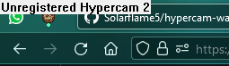
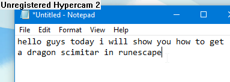
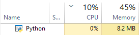

# hypercam-watermark
Unregistered HyperCam 2 watermark for your desktop.
A simple shitpost I made in 30 minutes for fun.
## Screenshots

very efficient on system resources

## how to run
Run the `.pyw` file or run the `.py` file using `pythonw.exe`
## how to close
Focus on the watermark window by clicking on it and press `Alt` + `F4` to close.
## notes
- Completely standalone, it does not use a picture of the watermark, instead uses the "System" font.
- Looks exactly like the real watermark on Windows, it looks similiar on Linux, I have not tested it on macOS
